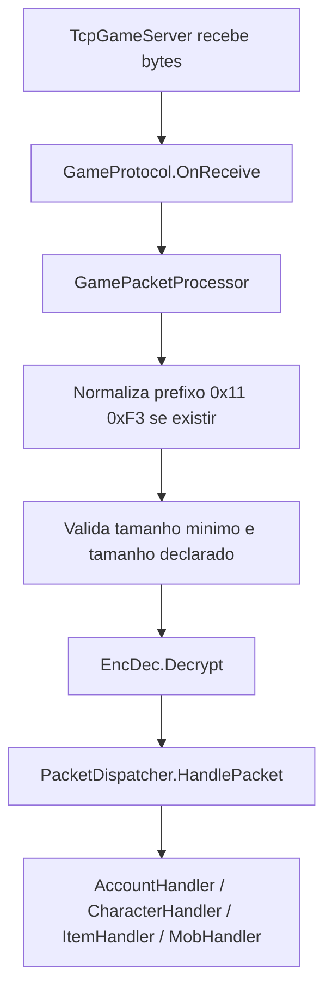
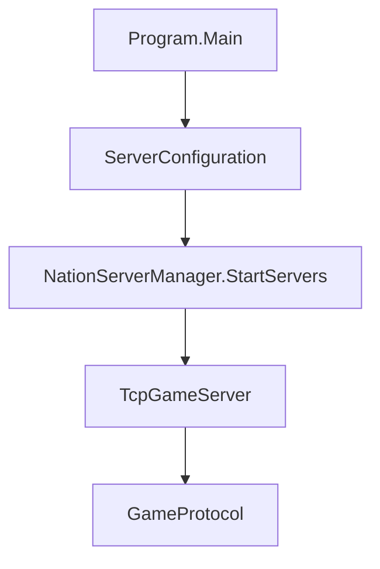

---
tags:
  - project/aika-og
  - architecture
updated: 2026-05-10
---

# Aika OG - Arquitetura Atual

Relacionado: [[Aika OG - MOC]], [[Aika OG - PacketDispatcher e Protocolo]], [[Aika OG - Sistema de Auth]]

## Visao geral

O `GameServer` esta organizado em camadas:

- `Domain`: entidades e value objects do dominio do jogo.
- `Application`: casos de uso, servicos, handlers de jogo, sessoes, mundo e configuracao.
- `Infrastructure`: rede TCP, buffers, persistencia, repositorios e carregamento de configuracao.
- `Presentation`: protocolo, streams de pacote, factories, pools e dispatch de opcodes.
- `Network`: mantem `EncDec` por compatibilidade com o cliente e o `PacketTool`.

## Camadas

### Domain

Arquivos principais:

- `GameServer/Domain/Entities/Accounts/AccountEntity.cs`
- `GameServer/Domain/Entities/Characters/CharacterEntity.cs`
- `GameServer/Domain/Entities/Items/ItemEntity.cs`
- `GameServer/Domain/Entities/Mobs/MobEntity.cs`
- `GameServer/Domain/ValueObjects/Position.cs`

Responsabilidade: representar estado e regras basicas do dominio sem depender de rede, banco ou protocolo.

### Application

Arquivos principais:

- `GameServer/Application/Services/CharacterService.cs`
- `GameServer/Application/Services/ItemService.cs`
- `GameServer/Application/Services/MobService.cs`
- `GameServer/Application/Sessions/Session.cs`
- `GameServer/Application/Sessions/SessionManager.cs`
- `GameServer/Application/World/WorldGrid.cs`
- `GameServer/Application/Handlers/Game/*Handler.cs`

Responsabilidade: coordenar fluxo de jogo, sessao ativa, criacao/listagem de personagens, escrita de pacotes de alto nivel e visibilidade no mundo.

### Infrastructure

Arquivos principais:

- `GameServer/Infrastructure/Networking/TcpGameServer.cs`
- `GameServer/Infrastructure/Networking/INetwork.cs`
- `GameServer/Infrastructure/Buffers/BufferManager.cs`
- `GameServer/Infrastructure/Buffers/RingBuffer.cs`
- `GameServer/Infrastructure/Persistence/GameDatabase.cs`
- `GameServer/Infrastructure/Persistence/Repositories/*Repository.cs`

Responsabilidade: detalhes externos, como socket TCP, pool de buffers, conexao MySQL e consultas SQL.

### Presentation

Arquivos principais:

- `GameServer/Presentation/Protocol/GameProtocol.cs`
- `GameServer/Presentation/Protocol/Packets/GamePacketProcessor.cs`
- `GameServer/Presentation/Packets/PacketDispatcher.cs`
- `GameServer/Presentation/Packets/PacketStream.cs`
- `GameServer/Presentation/Packets/PacketFactory.cs`

Responsabilidade: transformar bytes em pacotes, descriptografar, interpretar cabecalho, rotear opcode e montar respostas.

## Fluxo de pacote recebido

## Fluxo de inicializacao

## Pontos de atencao

- `EncDec` e keys sao contrato binario com o cliente.
- `PacketStream` preserva escrita/leitura little-endian usada pelos pacotes.
- `PacketFactory.FinalizePacket` escreve tamanho nos dois primeiros bytes.
- Repositorios ainda fazem SQL direto; uma evolucao futura seria introduzir interfaces em `Application` e implementacoes em `Infrastructure`.
