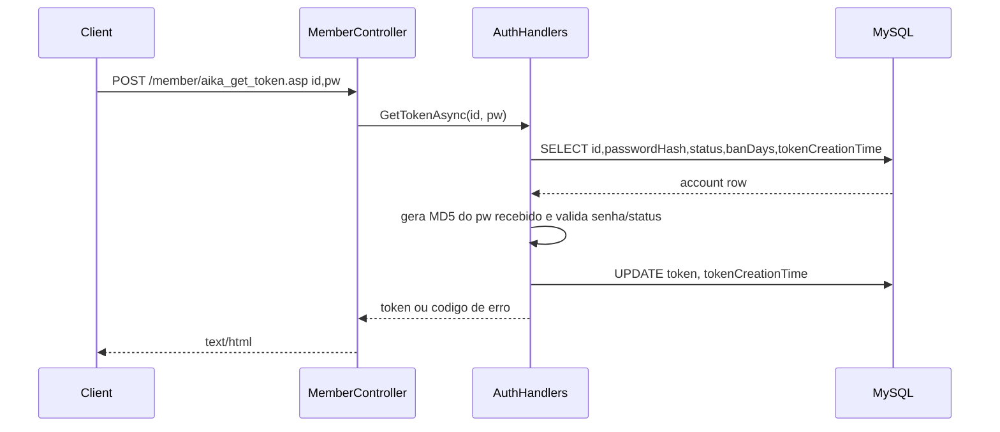

---
tags:
  - project/aika-og
  - auth
  - token-server
updated: 2026-07-02
---

# Aika OG - Sistema de Auth

Relacionado: [[Aika OG - MOC]], [[Aika OG - Arquitetura Atual]]

## Componentes

- `TokenServer/Controllers/MemberController.cs`: endpoints de token e criacao de conta.
- `TokenServer/Controllers/ServersController.cs`: contagem de personagens, lista simples de servidores e reset de flag/token.
- `TokenServer/Handlers/AuthHandler.cs`: regras atuais de autenticacao e geracao de token.
- `TokenServer/Handlers/DatabaseHandler.cs`: conexao MySQL via `Shared.Data.DatabaseConnectionFactory`.
- `Shared/Data/DatabaseConnectionFactory.cs`: le `AIKAOG_DATABASE` quando existir e usa connection string fallback.

## Endpoints atuais

| Metodo | Rota | Entrada | Saida |
|---|---|---|---|
| POST | `/member/aika_get_token.asp` | form `id`, `pw` | token ou codigo numerico em texto |
| POST | `/member/create_account` | JSON `username`, `passwordHash`, `accountType` | mensagem HTTP de criacao |
| POST | `/servers/aika_get_chrcnt.asp` | form `id`, `pw` | texto `CNT ... ...` |
| POST | `/servers/serv00.asp` | sem corpo | string de contagem de players por server |
| POST | `/servers/aika_reset_flag.asp` | form `id`, `pw` | sem corpo; renova token |

## Fluxo de login

## Codigos retornados por auth

- `"0"`: conta nao encontrada ou token invalido, dependendo do endpoint.
- `"-1"`: senha incorreta.
- `"-8"`: conta banida.
- `"-10"`: conta suspensa.
- `"-22"`: ban expirado e conta liberada.
- `"-99"`: erro interno.

## Observacoes importantes

- `GetTokenAsync` converte o `pw` recebido para MD5 hexadecimal lowercase antes de comparar com `accounts.passwordHash`.
- `GenerateToken` usa MD5 de um GUID para gerar token hexadecimal.
- `CreateAccountAsync` ainda usa connection string local propria e tabela/campos que parecem divergentes (`password_hash`, `premiumTime`) em relacao a outros pontos (`passwordHash`, `premiumExpiration`).
- `GetCharacterCountAsync` espera `pw` como token, nao senha.
- `ResetFlag` busca conta por username/token e renova token, mas nao valida explicitamente se encontrou linha antes de atualizar.

## Melhorias recomendadas

- Unificar `CreateAccountAsync` para usar `DatabaseHandler.GetConnectionAsync`.
- Padronizar nomes de colunas entre `accounts`, entidades e queries.
- Trocar retorno textual magic-number por constantes nomeadas.
- Introduzir `AuthService` e `IAccountTokenRepository` para separar controller, regra de auth e SQL.
- Adicionar testes para codigos de retorno e para ban expirado.
