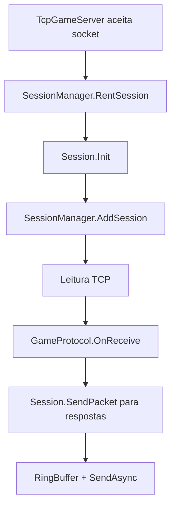

---
tags:
  - project/aika-og
  - service
  - session
updated: 2026-05-10
---

# Aika OG - SessionManager

Relacionado: [[Aika OG - Arquitetura Atual]], [[Aika OG - CharacterService]], [[Aika OG - MobService]]

Arquivos:

- `GameServer/Application/Sessions/Session.cs`
- `GameServer/Application/Sessions/SessionManager.cs`
- `GameServer/Infrastructure/Networking/TcpGameServer.cs`

## Responsabilidade

`SessionManager` gerencia sessoes ativas, pool de sessoes, pool de `SocketAsyncEventArgs`, personagens conectados e lista de visibilidade.

## Fluxo de sessao

## Funcoes importantes

- `RentSession`: cria/reutiliza sessao.
- `ReturnSession`: reseta e devolve ao pool.
- `AddSession`: registra sessao ativa.
- `RemoveSession`: remove sessao, limpa personagem ativo e remove do grid.
- `UpdateVisibleList`: sincroniza personagens proximos usando `WorldGrid`.
- `GetSessionByCharId`: localiza sessao por personagem.

## Pontos de cuidado

- `Session.Close` chama `INetwork.RemoveSession`, entao evitar chamadas circulares.
- `UpdateVisibleList` chama `MobHandler.CreateCharMob`; precisa de `ActiveAccount.ConnectionId` valido nas duas sessoes.
- `WorldGrid` remove personagens no logout/desconexao.
