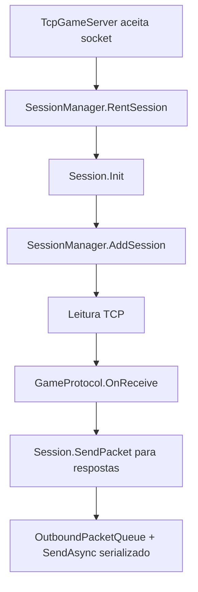

---
tags:
  - project/aika-og
  - service
  - session
updated: 2026-07-06
---

# Aika OG - SessionManager

Relacionado: [[Aika OG - Arquitetura Atual]], [[Aika OG - CharacterService]], [[Aika OG - MobService]]

Arquivos:

- `GameServer/Application/Sessions/Session.cs`
- `GameServer/Application/Sessions/SessionManager.cs`
- `GameServer/Infrastructure/Networking/TcpGameServer.cs`

## Responsabilidade

`SessionManager` gerencia sessoes ativas, personagens conectados e lista de visibilidade.

Desde 2026-07-06, `TcpGameServer` e o dono do ciclo de vida dos `SocketAsyncEventArgs` e dos blocos do `BufferManager`. `SessionManager` nao poola mais `Session`, porque a sessao contem socket, callback async e fila de envio; cada conexao cria uma `Session` e ela e descartada no fechamento.

Desde 2026-07-06, `SessionManager` tambem mantem indice O(1) de `CharacterEntity.Id -> Session`. O fluxo correto para associar personagem a sessao e `BindCharacter`; ele substitui atribuicoes diretas de `ActiveCharacter` no enter-world e permite que broadcast/AI/visibilidade evitem scans em todas as sessoes.

## Fluxo de sessao

## Funcoes importantes

- `RentSession`: cria uma sessao nova para a conexao.
- `ReturnSession`: descarta a sessao e libera o `SocketAsyncEventArgs` de escrita.
- `AddSession`: registra sessao ativa.
- `RemoveSession`: remove sessao, limpa personagem ativo e remove do grid.
- `BindCharacter` / `UnbindCharacter`: atualizam `ActiveCharacter`, `_characters`, indice por character id e `WorldGrid`.
- `UpdateVisibleList`: sincroniza personagens proximos usando `WorldGrid`.
- `GetSessionByCharId`: localiza sessao por personagem via indice, sem percorrer todas as sessoes.
- `VisibilityBroadcastService.SendToVisiblePlayers`: centraliza broadcast para self/visiveis e ignora ids stale.

## Pontos de cuidado

- `Session.Close` chama `INetwork.RemoveSession`, entao evitar chamadas circulares.
- `TcpGameServer.RemoveSession` deve devolver o read `SocketAsyncEventArgs` ao mesmo pool que o alugou, depois de `BufferManager.Empty` desconectar o buffer compartilhado.
- `Session.SendPacket` enfileira pacotes inteiros em `OutboundPacketQueue`, preserva ordem, aplica limite de bytes por sessao e mantem apenas um `SendAsync` ativo.
- `UpdateVisibleList` chama `MobHandler.CreateCharMob`; precisa de `ActiveAccount.ConnectionId` valido nas duas sessoes.
- `WorldGrid` remove personagens no logout/desconexao e precisa ser atualizado quando `CharacterMovementService` muda celula.
- Handlers de combate, skill, comandos e movimento devem usar `VisibilityBroadcastService` em vez de duplicar loops sobre `VisiblePlayers`.
